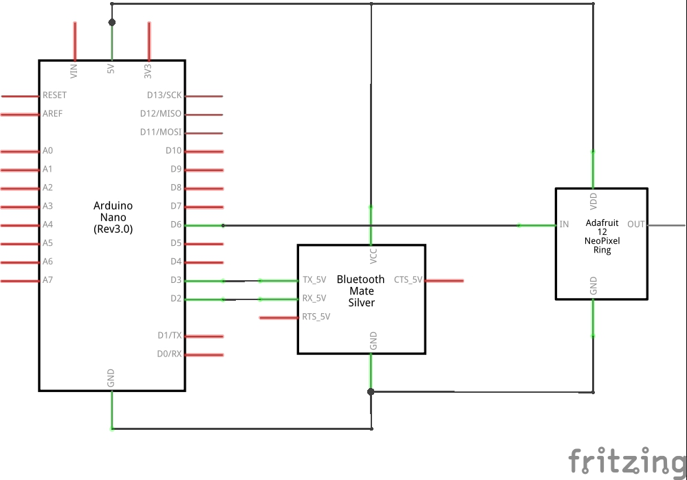

# arduino-ble-light
## Prerequisites
- [Arduino IDE](https://www.arduino.cc/en/Main/Software) (I compiled with 1.8.8)
- Arduino Board (I tested with an Arduino nano rev3.0)
- Adafruit NeoPixel Ring
- HM-10 module (BLE module)

## Layout

